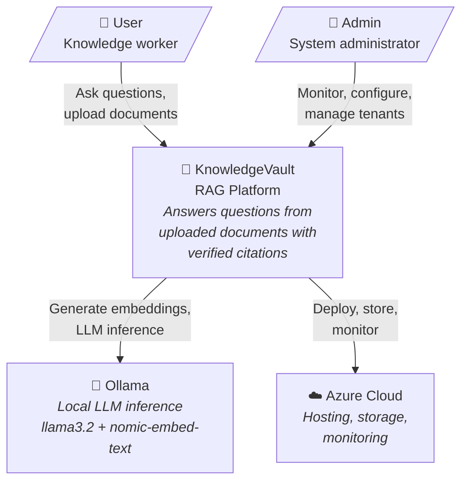
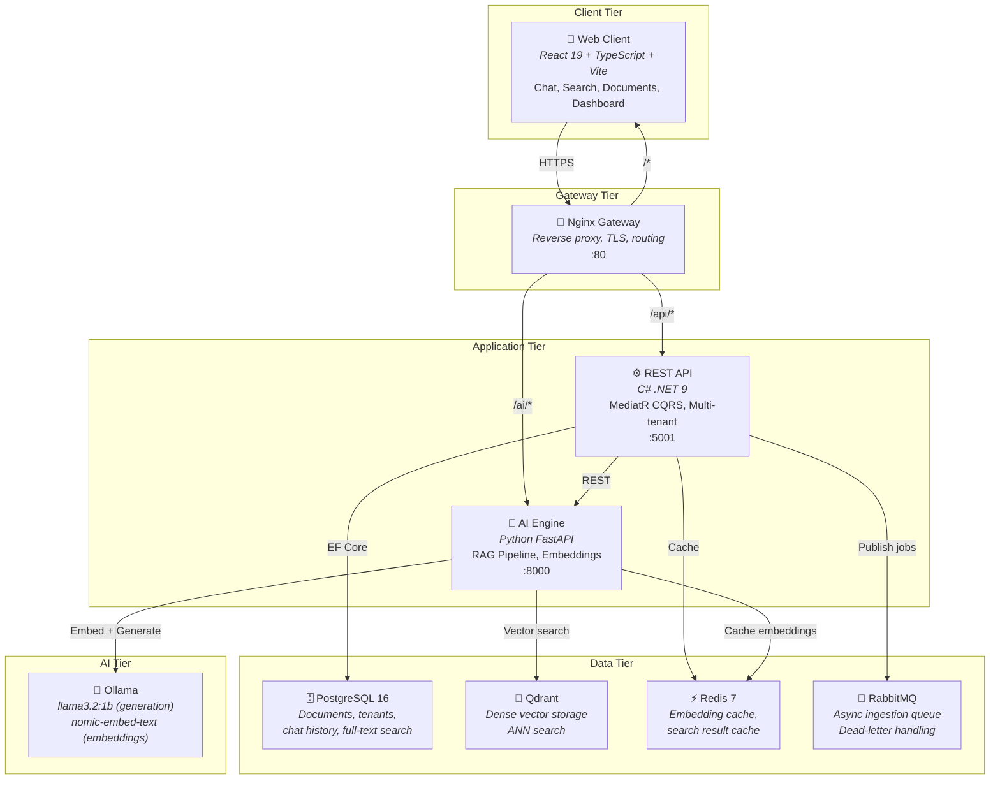
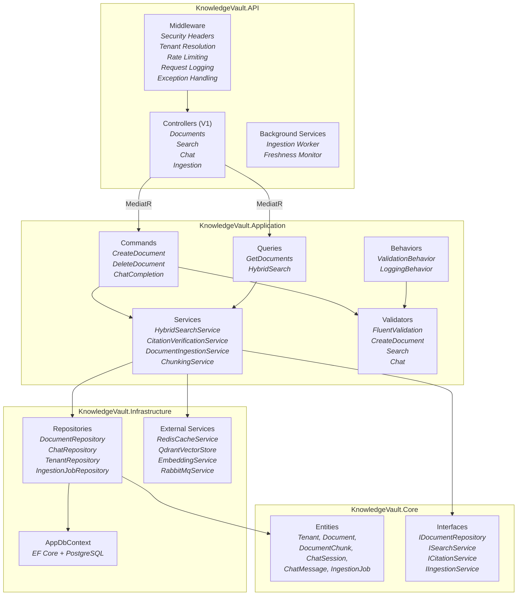
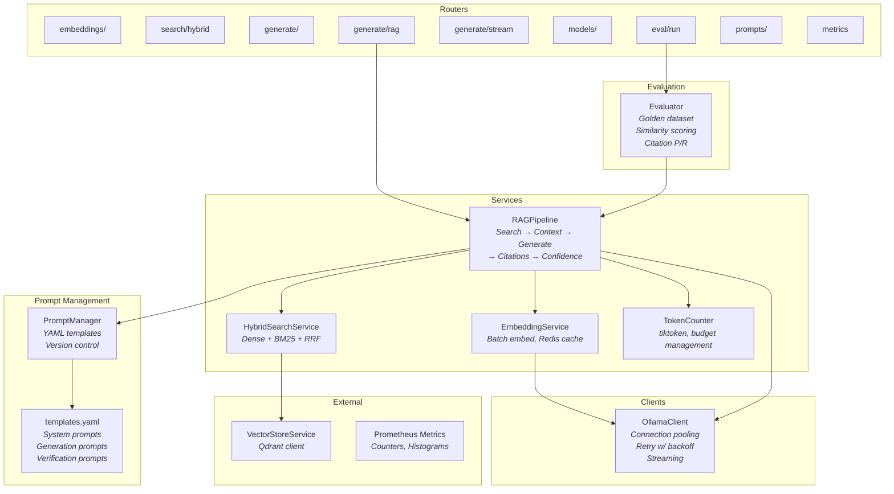
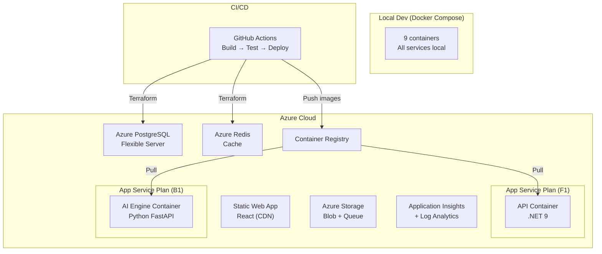
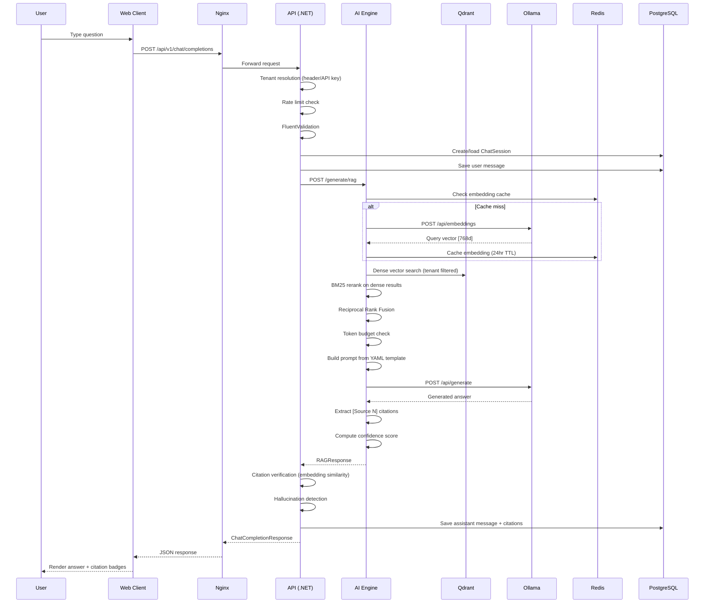
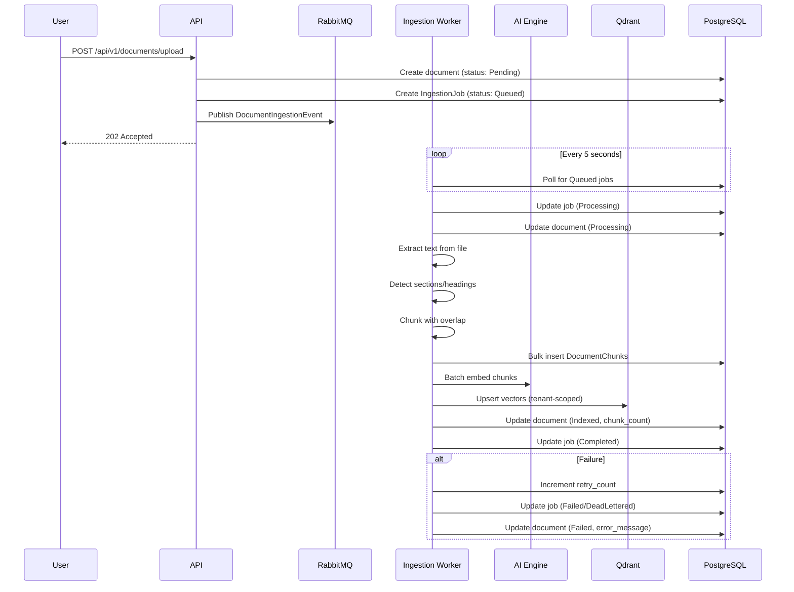
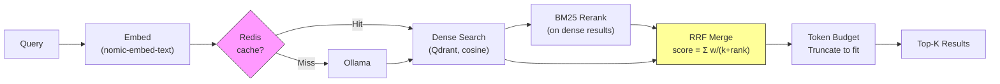
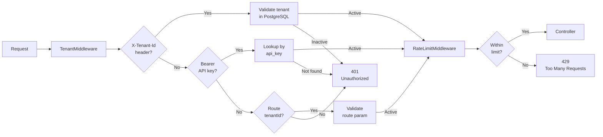
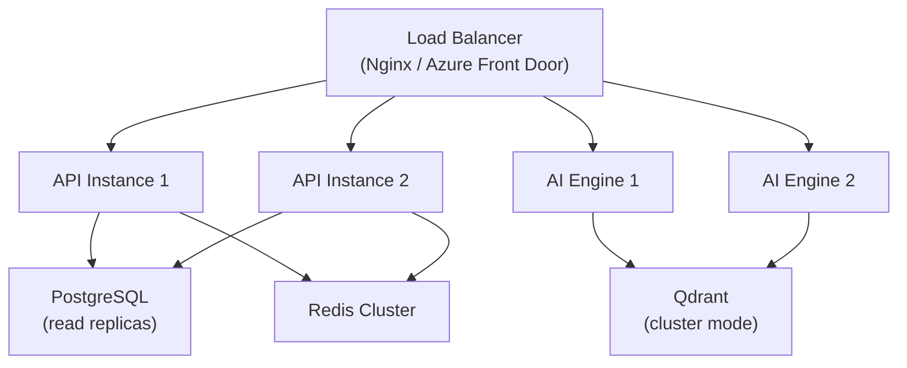

# KnowledgeVault — Architecture Documentation

## 1. High-Level Architecture

### System Context (C4 Level 1)

### Container Diagram (C4 Level 2)

### Component Diagram — API (C4 Level 3)

### Component Diagram — AI Engine

### Deployment Diagram

---

## 2. Technology Decisions

### ADR-001: C# .NET 9 for API

| Factor | .NET 9 | Node.js/Express | Go | Python/Django |
|--------|--------|----------------|----|----|
| Performance | Excellent | Good | Excellent | Moderate |
| Type safety | Strong (C#) | Weak (JS) / Good (TS) | Strong | Weak |
| ORM | EF Core (mature) | Prisma/TypeORM | GORM | Django ORM |
| CQRS/MediatR | Native ecosystem | Limited | Manual | Limited |
| Enterprise patterns | Excellent | Moderate | Minimal | Good |
| Async/await | Native | Native | Goroutines | asyncio |

**Decision:** .NET 9 for its mature enterprise patterns (MediatR, FluentValidation, EF Core), strong typing, excellent async support, and production-grade middleware pipeline.

### ADR-002: Qdrant for Vector Database

| Factor | Qdrant | Pinecone | Weaviate | Milvus | pgvector |
|--------|--------|---------|----------|--------|----------|
| Self-hosted | Yes | No | Yes | Yes | Yes |
| gRPC support | Yes | No | Yes | Yes | No |
| Filtering | Advanced | Basic | GraphQL | Advanced | SQL |
| Cost | Free (OSS) | $70+/mo | Free (OSS) | Free (OSS) | Free |
| Ease of use | High | High | Medium | Low | High |
| Tenant isolation | Payload filter | Namespace | Multi-tenancy | Partition | Row-level |

**Decision:** Qdrant for its zero-cost self-hosting, excellent filtering (tenant isolation via payload), gRPC performance, and simple API. pgvector was considered but lacks ANN performance at scale.

### ADR-003: React 19 for Frontend

**Decision:** React 19 with Vite for fast builds, TypeScript for type safety, Tailwind CSS for rapid UI development, Zustand for lightweight state management, and React Query for server state caching.

### ADR-004: RabbitMQ vs Kafka

| Factor | RabbitMQ | Kafka | Azure Queue |
|--------|---------|-------|-------------|
| Use case | Task queue | Event streaming | Simple queue |
| Complexity | Low | High | Very low |
| Dead-letter | Built-in | Manual | Built-in |
| Ordering | Per-queue | Per-partition | FIFO optional |
| Scale needed | Low-medium | High | Low |

**Decision:** RabbitMQ for document ingestion — we need reliable task delivery with dead-letter handling, not event streaming. Simpler to operate. Azure Storage Queue used in cloud deployment for cost savings.

---

## 3. Data Flow

### Chat Request Flow

### Document Ingestion Flow

### Hybrid Search Flow

---

## 4. Security Architecture

### Authentication Flow

### Security Layers

| Layer | Implementation |
|-------|---------------|
| Transport | HTTPS/TLS 1.2+ (Azure enforced, HSTS header) |
| Headers | SecurityHeadersMiddleware: CSP, X-Frame-Options, nosniff, XSS-Protection |
| Authentication | API key + Tenant ID (extensible to JWT) |
| Authorization | Tenant isolation on all queries (EF Core filters) |
| Rate limiting | Per-tenant sliding window (configurable `rate_limit_per_minute`) |
| Input validation | FluentValidation on all MediatR commands/queries |
| SQL injection | EF Core parameterized queries (no raw SQL) |
| XSS | React auto-escaping, CSP headers |
| Request tracing | X-Request-Id header on every response |

---

## 5. Scalability Design

### Current Bottlenecks & Solutions

| Bottleneck | Impact | Solution | Cost |
|-----------|--------|----------|------|
| LLM inference (CPU) | 2.5s P50 RAG latency | GPU server / Cloud LLM API | $13-50/mo |
| Single API instance | Limited concurrent requests | Horizontal scaling (App Service B1 x2) | +$13/mo |
| Redis single node | 250MB cache limit | Azure Redis Standard (2.5GB) | +$25/mo |
| PostgreSQL single vCore | Query throughput ceiling | Read replicas | +$50/mo |

### Horizontal Scaling Strategy

---

## 6. Operational Design

### Monitoring Strategy

| Metric | Source | Alert Threshold |
|--------|--------|----------------|
| HTTP 5xx rate | App Service | > 5 in 15 min |
| Response time P95 | App Insights | > 10 seconds |
| CPU utilization | Docker/Azure | > 80% for 5 min |
| Memory usage | Docker/Azure | > 90% |
| Queue depth | RabbitMQ | > 100 messages |
| Cache hit rate | Redis/Prometheus | < 30% |
| Embedding generation errors | Prometheus | > 5 in 10 min |
| Monthly cost | Azure Budget | > 80% of budget |

### Backup Strategy

| Data | Method | Frequency | Retention |
|------|--------|-----------|-----------|
| PostgreSQL | `pg_dump` / Azure auto-backup | Daily | 7 days |
| Qdrant | Snapshot API | Weekly | 30 days |
| Document blobs | Azure Storage geo-redundant | Continuous | 30 days |
| Redis | Not backed up (cache, reconstructible) | N/A | N/A |

---

## 7. Cost Optimization

### Current Monthly Cost (Azure Free Tier)

| Service | SKU | Cost |
|---------|-----|------|
| App Service (API) | F1 Free | $0 |
| App Service (AI) | B1 Basic | $13 |
| PostgreSQL Flexible | B1ms (free 12mo) | $0* |
| Redis Cache | Basic C0 | $16 |
| Container Registry | Basic | $5 |
| Static Web App | Free | $0 |
| Storage | Standard LRS | $0 |
| Application Insights | Free 5GB | $0 |
| **Total** | | **~$34/mo** |

*Free for first 12 months

### Optimization Strategies

1. **Use Ollama locally** for development, Groq free tier (30 req/min) for cloud demo
2. **Azure Storage Queue** replaces RabbitMQ in cloud ($0 vs $13/mo for CloudAMQP)
3. **Aggressive Redis caching** — 24hr embedding TTL, 5min search TTL reduces Ollama calls 50%+
4. **F1 tier API** — sufficient for portfolio demo traffic (60 CPU-min/day)

---

## 8. Future Roadmap

| Phase | Feature | Effort |
|-------|---------|--------|
| **v2.1** | JWT auth with refresh tokens | 1 week |
| **v2.1** | Document file upload (Azure Blob) | 1 week |
| **v2.2** | GPU-accelerated Ollama (CUDA) | 2 days |
| **v2.2** | Cross-encoder reranking (MiniLM) | 3 days |
| **v2.3** | WebSocket streaming for chat | 1 week |
| **v2.3** | Multi-language support | 2 weeks |
| **v3.0** | Kubernetes deployment (AKS) | 2 weeks |
| **v3.0** | Multi-model routing (Ollama + cloud) | 1 week |

---

## Risk Assessment

| Risk | Likelihood | Impact | Mitigation |
|------|-----------|--------|------------|
| Ollama model unavailable | Medium | High | Fallback model config, health checks |
| Rate limit exhaustion | Low | Medium | Per-tenant configurable limits, 429 response |
| Cache poisoning | Low | Medium | TTL expiry, Redis auth, key hashing |
| Tenant data leakage | Low | Critical | EF Core tenant filter on every query |
| Cost overrun | Medium | Low | Azure Budget alerts at 80%/100% |
| LLM hallucination | High | Medium | Citation verification, confidence scoring, hedging detection |
